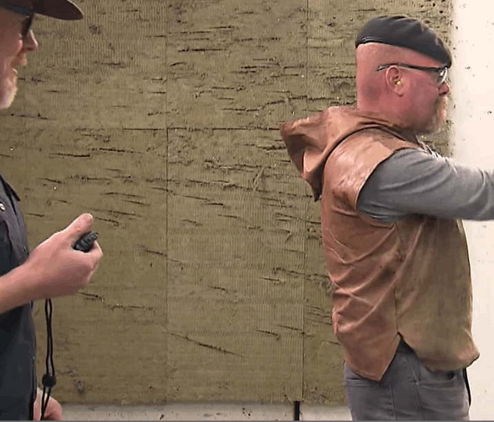
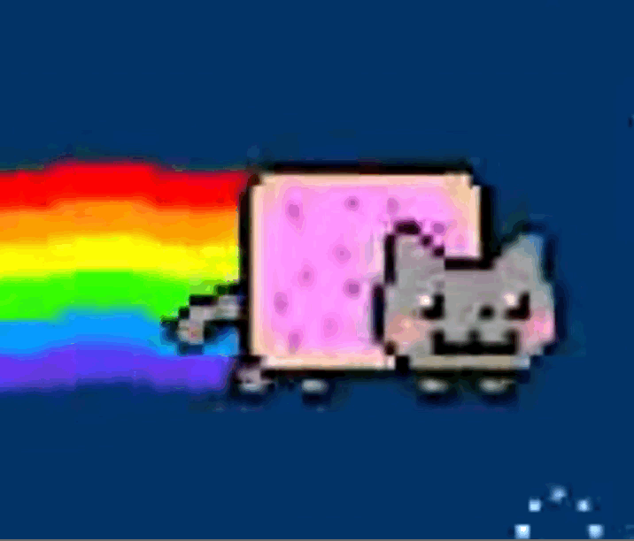
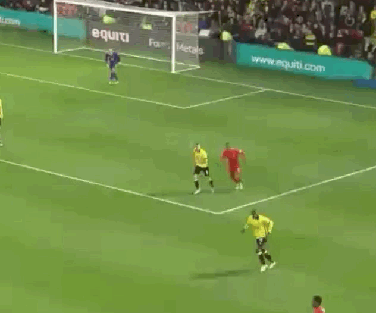

# GifCapture

 
 

 
 

# Description

- Gif capture app for macOS
- Featured on Product Hunt https://www.producthunt.com/posts/gifcapture
- Featured on Softpedia http://mac.softpedia.com/get/Graphics/GifCapture.shtml
- Icon http://emojione.com/
- NSGIF https://github.com/NSRare/NSGIF

# Features

- [x] Resizable window
- [x] Key equivalent (Cmd+R, Cmd+S)
- [x] Open captured gif from notification banner
- [x] Preferences
- [ ] Progress HUD
- [ ] Multiple screens
- [ ] Select application to capture

# Demo

# How to use

### Binary
- Get the binary from https://github.com/onmyway133/GifCapture/releases

### Brew Cask
- Run `brew cask install gifcapture`

## Author

Khoa Pham, onmyway133@gmail.com

## License

**GifCapture** is available under the MIT license. See the [LICENSE](https://github.com/onmyway133/GifCapture/blob/master/LICENSE.md) file for more info.
