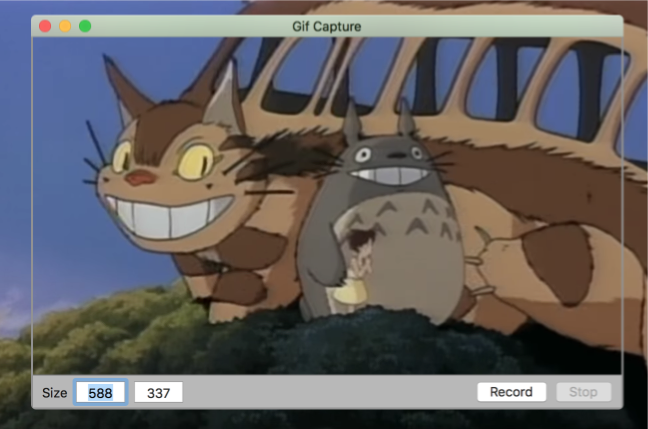

# GifCapture

# Description

- Gif capture app for macOS
- Icon from http://emojione.com/

# Features

- [x] Resizable window
- [x] Key equivalent (Cmd+R, Cmd+S)
- [x] Open captured gif from notification banner
- [x] Preferences

## Author

Khoa Pham, onmyway133@gmail.com

## License

**GifCapture** is available under the MIT license. See the [LICENSE](https://github.com/onmyway133/GifCapture/blob/master/LICENSE.md) file for more info.
